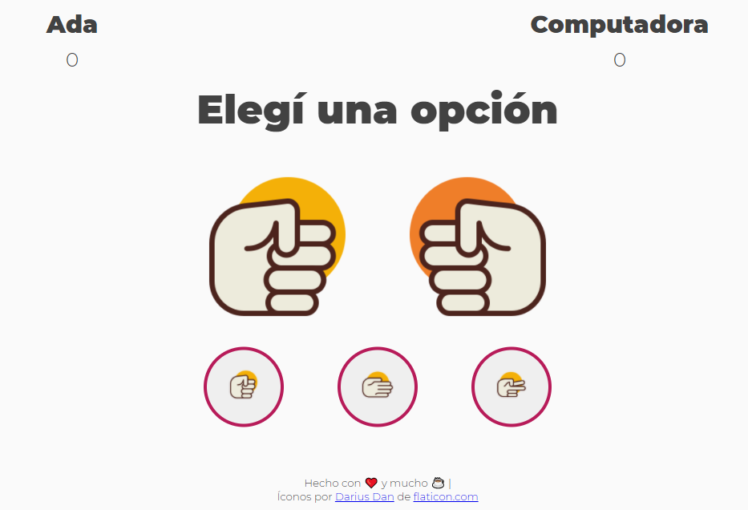

# Juego Básico Piedra Papel y Tijera

[Enlace al juego](https://lmbd92.github.io/Piedra-Papel-Tijera/)

En este repo encontrarás la estructura y logica básica del juego.

### Lenguajes usados:

1. HTML5
2. CSS3
3. Js

